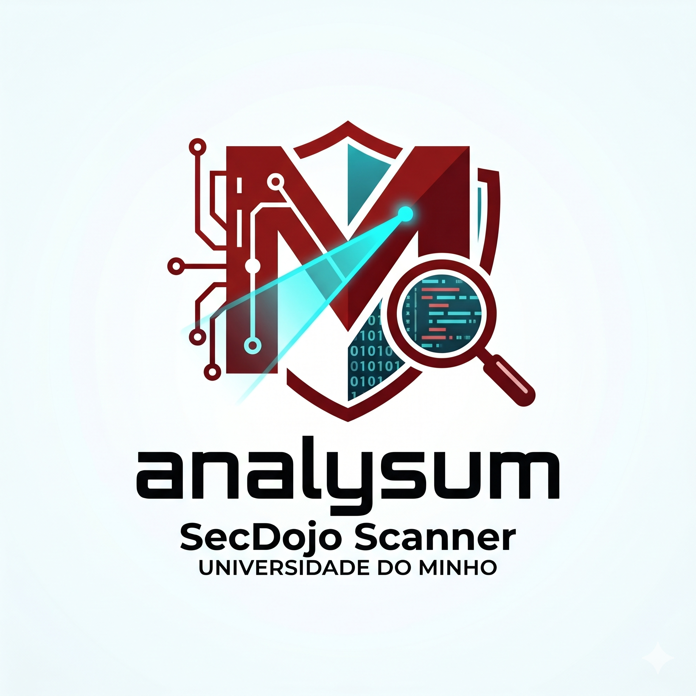

<div align="center">
  <!-- Logos: Side-by-Side -->
  <p>
    <!-- Your Project Logo (corrected path) -->
    
    &nbsp;&nbsp;&nbsp;&nbsp;&nbsp; <!-- Spacing -->
    <!-- University of Minho Logo -->
    
  </p>

  <!-- Project Title -->
  <h1>Analysum1</h1>

  <!-- Badges -->
  <p>
    <a href="https://github.com/your-username/your-repo/releases">
      
    </a>
    <a href="https://github.com/your-username/your-repo/actions">
      
    </a>
    <a href="https://opensource.org/licenses/Apache-2.0">
      
    </a>
    <a href="https://github.com/your-username/your-repo/pulls">
      
    </a>
  </p>

  <!-- Authors -->
  <p>
    <b>Diogo Rodrigues</b> (<a href="mailto:pg60244@alunos.uminho.pt">pg60244@alunos.uminho.pt</a>) &nbsp;&bull;&nbsp;
    <b>Matilde Oliveira</b> (<a href="mailto:pg60283@alunos.uminho.pt">pg60283@alunos.uminho.pt</a>) &nbsp;&bull;&nbsp;
    <b>Tiago Teixeira</b> (<a href="mailto:pg58716@alunos.uminho.pt">pg58716@alunos.uminho.pt</a>)
  </p>
</div>

## Table of Contents

- [Description](#description)
  - [The Problem: Tool Fragmentation](#the-problem-tool-fragmentation)
  - [The Solution: A Unified Approach](#the-solution-a-unified-approach)
- [Features](#features)
- [Technologies](#technologies)
- [Prerequisites](#prerequisites)
- [Installation](#installation)
  - [Option 1: Native Installation (Windows)](#option-1-native-installation-windows)
  - [Option 2: Native Installation (Ubuntu / Debian)](#option-2-native-installation-ubuntu--debian)
  - [Option 3: Native Installation (macOS)](#option-3-native-installation-macos)
  - [Option 4: Docker — Per-Language Images (Recommended for CI)](#option-4-docker--per-language-images-recommended-for-ci)
  - [Option 5: Docker — Unified Image (Recommended for Local Use)](#option-5-docker--unified-image-recommended-for-local-use)
  - [Verifying Your Installation](#verifying-your-installation)
  - [Known Installation Gotchas](#known-installation-gotchas)
- [Usage](#usage)
  - [Interactive Mode (Wizard)](#interactive-mode-wizard)
  - [Direct CLI (Recommended for CI/CD)](#direct-cli-recommended-for-cicd)
  - [Where Does the Output Go?](#where-does-the-output-go)
- [Tests & Fixtures](#tests--fixtures)
  - [Testing the Rust Pipeline](#testing-the-rust-pipeline)
  - [Testing the C Pipeline](#testing-the-c-pipeline)
- [Contributing](#contributing)
  - [Quick Workflow (External Contributors)](#quick-workflow-external-contributors)
  - [Quick Workflow (Internal Contributors)](#quick-workflow-internal-contributors)
  - [Pull Request Requirements](#pull-request-requirements)
  - [Ethics and Responsible Disclosure](#ethics-and-responsible-disclosure)
- [License](#license)
- [Authors & Contact](#authors--contact)

## Description

**SecDojo Scanner** (`secdojo-scan`) is a unified static analysis CLI orchestrator that aggregates best-in-class security tools for **C/C++** and **Rust** codebases into a single workflow. 

### The Problem: Tool Fragmentation
While most teams have access to excellent static analysis tools, reviewing their results often means dealing with a highly fragmented ecosystem. Different tools emit different formats like XML (Cppcheck), CSV (Flawfinder), JSON (Semgrep), NDJSON (cargo-clippy), or plain text. Furthermore, each tool uses its own severity vocabulary, forcing developers to open multiple terminals and manually reconcile conflicting data.

### The Solution: A Unified Approach
SecDojo Scanner does not aim to reinvent static analysis, instead, it removes friction by eliminating the "integration tax." It provides teams with a **single command** and a **single output format**, regardless of the language being audited.

The orchestrator solves fragmentation by:
*   **Running** every underlying tool consistently with standardized flags and timeouts.
*   **Parsing** heterogeneous outputs into a uniform internal finding model.
*   **Normalizing** severities onto a common five-level scale (`CRITICAL` → `INFO`).
*   **Emitting** a single, normalized **SARIF 2.1.0** document.

By consolidating the output, SecDojo Scanner delivers the analytical depth of individual scanners via a format that is immediately ready to be consumed by CI/CD pipelines, security dashboards, and GitHub Code Scanning.

## Features

- **Unified Polyglot Scanning:** Audit both **C/C++** and **Rust** codebases with a single CLI command (`--lang all`). No need to orchestrate multiple tools manually.
- **Intelligent Normalization:** Automatically parses heterogeneous tool outputs (XML, JSON, CSV, text) into a single, standardized internal data model.
- **Common Severity Scale:** Translates tool-specific severity vocabularies into a unified, actionable five-level scale (`CRITICAL`, `HIGH`, `MEDIUM`, `LOW`, `INFO`).
- **Smart Deduplication:** Reduces alert fatigue by merging overlapping findings from different tools based on exact location and rule type `(file, line, ruleId)`.
- **SARIF 2.1.0 Native:** Emits a single, aggregated SARIF document ready to be ingested by CI/CD pipelines, GitHub Code Scanning, and security dashboards.
- **CI/CD Optimized:** Designed for automation with meaningful pipeline exit codes (0=clean, 1=findings, 2=error), robust timeout handling, and parallel chunking for massive codebases.
- **Extensible Architecture:** A highly modular design that strictly separates runners (I/O) from parsers (pure functions), making it trivial to plug in new security tools or languages.
- **Interactive Wizard Mode:** Includes a zero-configuration, interactive CLI wizard for easy onboarding and local developer testing.

## Technologies

SecDojo Scanner acts as a unified orchestrator leveraging several industry-standard tools:

* **Core Orchestrator:** [Python 3.10+](https://www.python.org/)
* **C/C++ Security Tools:**
* [Cppcheck](https://cppcheck.sourceforge.io/)
* [Flawfinder](https://dwheeler.com/flawfinder/)
* [Semgrep](https://semgrep.dev/)

* **Rust Security Tools:**
* [Cargo-audit](https://github.com/RustScan/cargo-audit) (RustSec advisories)
* [Cargo-geiger](https://github.com/lmduhaupas/cargo-geiger) (Unsafe code analysis)
* [Clippy](https://github.com/rust-lang/rust-clippy) (Rust linter)

* **Infrastructure:** [Docker](https://www.docker.com/)

## Prerequisites

You only need to install the toolchains for the languages you intend to scan. If you are using Docker (recommended), you only need Git and Docker installed on your host machine.

**General Requirements:**

* **OS:** Windows, macOS, or Linux
* **RAM:** 8 GB recommended (the Rust toolchain is memory-hungry on large projects)
* **Git** (to clone target repositories)
* **Python 3.10+**

**Per-Language Requirements (for Native Installation):**

| Language | Required Tools | Minimum Version |
| --- | --- | --- |
| **C / C++** | Cppcheck, Flawfinder, Semgrep | 2.x (Cppcheck/Flawfinder), 1.x (Semgrep) |
| **Rust** | rustc, cargo, cargo-audit, cargo-geiger, clippy | 1.70+ (Rust stable) |


## Installation

There are several ways to run SecDojo Scanner: via **Docker** (recommended for reproducibility and zero host-pollution) or via **Native Installation**.

First, clone the repository:

```bash
git clone https://github.com/secdum/analysum1.git
cd analysum1

```

### Option 1: Native Installation (Windows)

#### 1. Install Python

Download Python 3.10+ from [python.org](https://www.python.org/downloads/). During installation, **check "Add Python to PATH"**.

Verify:

```powershell
python --version
```

#### 2. Install C Tools

**Cppcheck:**
Download the installer from [cppcheck.sourceforge.io](http://cppcheck.sourceforge.io/). During installation, check "Add to PATH".

**Flawfinder:**
```powershell
pip install flawfinder
```

**Semgrep:**
```powershell
pip install semgrep
```

Verify:

```powershell
cppcheck --version
flawfinder --version
semgrep --version
```

#### 3. Install Rust Toolchain

Download and run `rustup-init.exe` from [rustup.rs](https://rustup.rs/). Accept the defaults. Then open a **new** PowerShell window and run:

```powershell
rustup component add clippy
cargo install cargo-audit
cargo install cargo-geiger
```

Verify:

```powershell
cargo --version
cargo clippy --version
cargo audit --version
cargo geiger --version
```

#### 4. Common Windows Issues

| Symptom | Cause | Fix |
|---------|-------|-----|
| `cargo` not recognized after install | PATH not refreshed | Close and reopen PowerShell |
| `cargo-geiger` build fails | Missing Visual C++ Build Tools | Install [Visual Studio Build Tools](https://visualstudio.microsoft.com/visual-cpp-build-tools/) with "C++ build tools" workload |
| `semgrep` fails on Python 3.12+ | Dependency incompatibilities | Use Python 3.10 or 3.11 |
| `cppcheck` not recognized | Not added to PATH during install | Add `C:\Program Files\Cppcheck` to your system PATH manually |

---

### Option 2: Native Installation (Ubuntu / Debian)

#### 1. Install Python Dependencies

The scanner itself has minimal runtime dependencies (subprocess, json, dataclasses — all stdlib). Semgrep, however, is a Python package:

```bash
pip3 install semgrep
```

#### 2. Install C Tools

```bash
sudo apt update
sudo apt install -y cppcheck flawfinder
```

Verify:

```bash
cppcheck --version
flawfinder --version
semgrep --version
```

#### 3. Install Rust Toolchain

```bash
curl --proto '=https' --tlsv1.2 -sSf https://sh.rustup.rs | sh -s -- -y
source "$HOME/.cargo/env"

rustup component add clippy
cargo install cargo-audit
cargo install cargo-geiger
```

Verify:

```bash
cargo --version
cargo clippy --version
cargo audit --version
cargo geiger --version
```

---

### Option 3: Native Installation (macOS)

```bash
# C tools
brew install cppcheck
pipx install flawfinder
pipx install semgrep

# Rust tools
curl --proto '=https' --tlsv1.2 -sSf https://sh.rustup.rs | sh -s -- -y
rustup component add clippy
cargo install cargo-audit
cargo install cargo-geiger
```

`pipx` is preferred over `pip` for CLI tools because it isolates each tool in its own venv, avoiding global Python pollution.

---

### Option 4: Docker — Per-Language Images (Recommended for CI)

The repository ships Dockerfiles for each language plus a unified one. Use the per-language ones when you only care about a single language and want fast image builds.

#### C-Only Image

```bash
docker build -t secdojo-c-scanner -f scanners/C/dockerfile .
docker run --rm -v "$(pwd)/target_repo:/scan" secdojo-c-scanner cppcheck /scan
```

#### Rust-Only Image

```bash
docker build -t secdojo-rust-scanner -f scanners/Rust/Dockerfile.rust .
docker run --rm -v "$(pwd)/target_repo:/app" secdojo-rust-scanner cargo audit --json
```

On Windows, replace `$(pwd)` with `${PWD}` in PowerShell or use the full path:

```powershell
docker run --rm -v "${PWD}\target_repo:/scan" secdojo-c-scanner cppcheck /scan
```

---

### Option 5: Docker — Unified Image (Recommended for Local Use)

When you want a single container that can scan both languages:

```bash
docker build -f Dockerfile.unified -t secdojo-scanner .
docker run -it --rm -v "$(pwd):/work" secdojo-scanner
```

On Windows (PowerShell):

```powershell
docker build -f Dockerfile.unified -t secdojo-scanner .
docker run -it --rm -v "${PWD}:/work" secdojo-scanner
```

The unified image is larger (around 1.5 GB) because it installs the full Rust toolchain alongside the C tools, but it is the smoothest path for end users. 

---

### Verifying Your Installation

From the repository root:

```bash
python3 secdojo/secdojo_scan.py --lang rust --path examples/rust_insecure
```

On Windows:

```powershell
python secdojo/secdojo_scan.py --lang rust --path examples/rust_insecure
```

You should see the SecDojo banner, a configuration confirmation, and then either findings or a clean "no issues found" report. If you see `cargo: command not found`, your Rust toolchain is not on PATH: restart your terminal.

To verify the C side:

```bash
python secdojo/secdojo_scan.py --lang c --path examples/c_vun_codes
```

---

## Known Installation Gotchas

| Symptom | Platform | Cause | Fix |
|---------|----------|-------|-----|
| `cargo geiger` hangs or fails | All | Missing system dev libraries (e.g. NASM for `aws-lc-sys`) | Install `nasm`; see [[Rust Toolchain]] |
| `cargo-geiger` build fails | Windows | Missing C++ compiler | Install [Visual Studio Build Tools](https://visualstudio.microsoft.com/visual-cpp-build-tools/) |
| Semgrep install fails | All | Python 3.12+ incompatibility | Use `pipx` or pin to Python 3.10/3.11 |
| Cppcheck reports `unknown checker` | All | Old Cppcheck version | Upgrade to 2.10+ |
| `flawfinder --csv` unexpected columns | Linux/macOS | Locale-dependent CSV dialect | Set `LC_ALL=C` before invoking |
| `python3` not recognized | Windows | Windows uses `python` not `python3` | Use `python` instead, or create an alias |
| Docker volume mount fails | Windows | Path format differences | Use `${PWD}` in PowerShell, not `$(pwd)` |


## Usage

This guide takes you from a clean clone to your first scan report in under five minutes. You can run SecDojo Scanner in two ways: through an interactive wizard or directly via CLI flags.

### Interactive Mode (Wizard)
If you run the scanner without any arguments, it drops you into a guided wizard. It will prompt you to select the language and the repository path. This is perfect for first-time users and demos:

```bash
python3 secdojo/secdojo_scan.py
```

### Direct CLI (Recommended for CI/CD)
Once you understand the flags, the direct CLI is much faster and suitable for automation.

Scan a Rust Project:

```bash
python3 secdojo/secdojo_scan.py --lang rust --path ./my_rust_project
```

Scan a C/C++ Project:

```bash
python3 secdojo/secdojo_scan.py --lang c --path ./my_c_project
```

Polyglot Scan (Both Languages):
Runs the C and Rust pipelines sequentially and aggregates findings into a single report.

```bash
python3 secdojo/secdojo_scan.py --lang all --path ./my_monorepo
```

### Where Does the Output Go?

#### 1. Console (Default): Findings are printed to stdout in a human-readable, colorized format, showing severity, tool, type, message, and location.

#### 2. SARIF File: SecDojo can generate SARIF 2.1.0 reports. You can interact with these reports using standard tools like jq to get quick metrics:

```bash
# Count results per tool
jq '.runs[] | {tool: .tool.driver.name, count: (.results | length)}' report.sarif

# List all critical findings
jq '.runs[].results[] | select(.level=="error") | .message.text' report.sarif
```
Tip: You can visualize the SARIF file by dropping it into the Microsoft SARIF Viewer Web or uploading it to GitHub's Security tab.

## Tests & Fixtures

The repository ships with deliberately vulnerable code fixtures. This allows you to verify your installation, test the parsers, and see how the scanner behaves without needing to scan a real project first.

### Testing the Rust Pipeline

The examples/rust_insecure/ directory contains a project with pinned, vulnerable dependencies known to trigger RustSec advisories.

```bash
python3 secdojo/secdojo_scan.py --lang rust --path examples/rust_insecure
```

What to expect: The scanner will run cargo audit, cargo geiger, and cargo clippy in sequence. It will print a list of findings (e.g., [CRITICAL] cargo-audit (vulnerability)) and exit with code 1 (findings detected).

### Testing the C Pipeline

The examples/c_vun_codes/ directory contains C code with deliberate buffer overflows, format string vulnerabilities, use-after-free, and memory leaks.

```bash
python3 secdojo/secdojo_scan.py --lang c --path examples/c_vun_codes
```

What to expect: You should see findings from Flawfinder (flagging functions like strcpy and gets) and Cppcheck (flagging memory leaks and null pointer dereferences). The script will exit with code 1.


## Contributing

Contributions are what make the open-source community such an amazing place to learn, inspire, and create. Any contributions you make are **greatly appreciated**. 

We follow a simplified **Git Flow** model to ensure the stability of the `main` branch. All new development should be branched from and merged back into the `develop` branch.

### Quick Workflow (External Contributors)

If you don't have write access to the repository, you'll need to fork it first.

1. **Fork the Repository:** Click the "Fork" button at the top right of this page to create your own copy of the repository.
2. **Clone your Fork:**
   ```bash
   git clone https://github.com/your-username/analysum1.git
   cd analysum1
   ```
3. **Add Upstream Remote:**
   ```bash
   git remote add upstream https://github.com/secdum/analysum1.git
   ```
4. **Sync with Upstream:** Ensure you start from the latest `develop` branch.
   ```bash
   git fetch upstream
   git checkout develop
   git merge upstream/develop
   ```
5. **Create a Feature Branch:**
   ```bash
   git checkout -b feature/your-feature-name
   ```
6. **Commit your Changes:** Use conventional commits and reference the issue number to auto-close it.
   ```bash
   git commit -m "feat: implement amazing parser closes #1"
   ```
7. **Push and PR:** Push your branch to your fork and open a Pull Request against the original repository's `develop` branch.
   ```bash
   git push origin feature/your-feature-name
   ```

### Quick Workflow (Internal Contributors)

1. **Check Issues:** Ensure the task is registered on GitHub. Assign it to yourself and move it to "In Progress".
2. **Update Base:** Always start from the latest `develop` branch.
   ```bash
   git checkout develop
   git pull origin develop
   ```
3. **Create a Feature Branch:** 
   ```bash
   git checkout -b feature/your-feature-name
   ```
4. **Commit your Changes:** Use conventional commits and reference the issue number to auto-close it.
   ```bash
   git commit -m "feat: implement amazing parser closes #1"
   ```
5. **Push and PR:** Push your branch and open a Pull Request against the `develop` branch.


### Pull Request Requirements
Before your PR can be merged into develop, it must meet the following criteria:

- **Code Review:** At least one approval from a team member.
- **Validation Proof:** Attach a screenshot or log output (e.g., the generated JSON/SARIF file) directly in the PR description.
- **CI & Tests:** GitHub Actions must pass (Docker builds, smoke tests), and it must run successfully against the local fixtures.

### Ethics and Responsible Disclosure
SecDojo Scanner is a security tool. If, while testing the scanner against real-world repositories (e.g., curl, openssl), you discover a critical vulnerability or exposed secrets:

1. **Do NOT publish the details in our public README, PRs, or open issues.**
2. **Consult the SECURITY.md file of the affected target repository.**
3. **Inform the group privately so we can proceed with a responsible disclosure process.**

#### Note: For the complete and detailed guidelines, please read our full [Contributing Guide](docs/CONTRIBUTING.md).

## License

This project is open-source and distributed under the **Apache License, Version 2.0** (January 2004).

You are free to use, modify, distribute, and use this software for commercial purposes, provided that you:
* Include a copy of the license.
* Retain the original copyright notices.
* State any significant changes made to the original code.

For more details, please see the full [LICENSE](LICENSE) file in this repository or visit the official [Apache 2.0 License page](https://www.apache.org/licenses/LICENSE-2.0).

## Authors & Contact

**SecDojo Scanner** was developed and is maintained by our team. If you have any questions, feedback, or just want to connect, feel free to reach out to any of us:

*   **Diogo Rodrigues**
    *   Email: [pg60244@alunos.uminho.pt](mailto:pg60244@alunos.uminho.pt)
    *   LinkedIn: [https://www.linkedin.com/in/diogo--rodrigues](https://www.linkedin.com/in/diogo--rodrigues)

*   **[Matilde Oliveira]**
    *   Email: [pg60283@alunos.uminho.pt](mailto:pg60283@alunos.uminho.pt)
    *   LinkedIn: [https://www.linkedin.com/in/matildeoliveira0/](https://www.linkedin.com/in/matildeoliveira0/)

*   **[Tiago Teixeira]**
    *   Email: [pg58716@alunos.uminho.pt](mailto:pg58716@alunos.uminho.pt)
    *   LinkedIn: [https://www.linkedin.com/in/tiago-teixeira-1b03ab32a/](https://www.linkedin.com/in/tiago-teixeira-1b03ab32a/)
